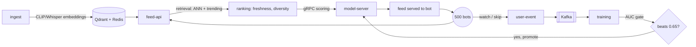

# Siphon

A working recommendation system with the same shape as TikTok's: content goes in, personalized feeds come out, and the model retrains itself from what users do. Built end to end as a monorepo of microservices.

It's not a 1:1 clone of TikTok's production stack. It's the same architecture: two-tower retrieval, multi-stage ranking, and a streaming retrain loop that provably improves its own ranking quality over time.

## What it does

A swarm of 500 bots watches videos. Every watch and skip becomes an event. Those events flow through Kafka into a trainer that periodically retrains the ranking model, checks it against a quality gate, and promotes it if it's better. The feed API then serves feeds from the new model. The loop runs on its own, and you can watch it happen on a live dashboard.



## Stack

- **Python 3.13** ML services: ingest, feature, training, model-server, sim-engine
- **Go 1.25** serving: feed-api, user-event, dashboard-api
- **React + Vite** dashboard
- **Kafka** (KRaft) for the event stream, **Qdrant** for vector search, **Redis** for sessions and trending, **MinIO** for model artifacts, **Postgres** for interactions and training runs
- **Prometheus + Grafana** for metrics

Sixteen services, one `docker compose` network.

## The model

A two-tower model. One tower embeds users, one embeds items, and their dot product scores a match. This is the same architecture Google published for YouTube retrieval (Yi et al., 2019). The trainer uses BPR (learn to rank a watched item above a skipped one) and only promotes a new model if its AUC clears 0.65.

Items are embedded from their content: CLIP for frames, Whisper for audio, projected to a shared 256-dim space that both training and serving read from the same place. Train and serve never drift.

## Run it

```bash
make up      # boots all 16 services, waits for healthy
make seed    # loads 1000 videos and 500 users
```

Then open the dashboard and watch the bots work.

| What | Where |
|------|-------|
| Dashboard (live feed, training, A/B) | http://localhost:3000 |
| Grafana (admin/admin) | http://localhost:3001 |
| Prometheus | http://localhost:9090 |
| MinIO console | http://localhost:9001 |

Ask the feed API directly:

```bash
curl 'localhost:8005/feed?user_id=u000000&limit=5'
```

Prove the loop learns:

```bash
make quality-gate    # asserts the latest trained model beat the AUC gate
```

Tear down:

```bash
make down
```

## What's real and what isn't

Real: the full flywheel runs. Seed the content, bots watch, events stream, the trainer retrains on its own, the AUC gate passes, the model gets promoted, and the next feed reflects it. On a normal run that's tens of thousands of interactions, feed latency around 13ms, and the model climbing past the gate without anyone touching it.

Not real: production TikTok scale. The ranking model is a single scalar (did they watch it) rather than TikTok's multi-task value model that predicts likes, shares, and follows and blends them. Signals come from simulated bots, not people. One box, not a fleet.

The gap between "TikTok-shaped" and "TikTok" is mostly that multi-task ranking head. Everything else here is the honest architecture.

## Layout

Each service is its own directory with its own tests.